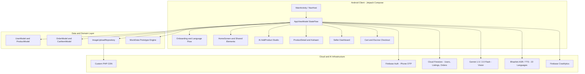
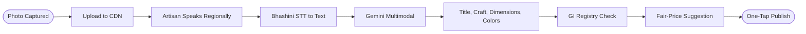
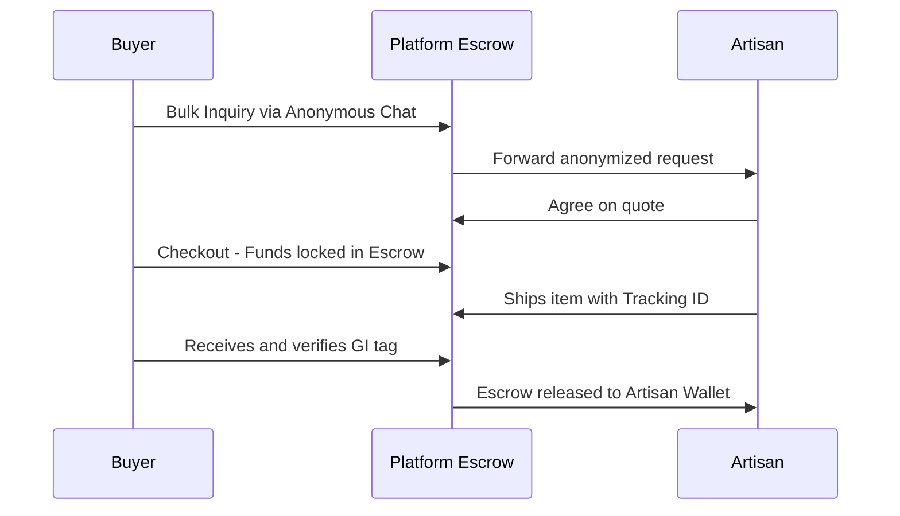

<!-- DHAAGA README | Theme-aware | Lucide icons with palette colors | Mobile-first -->

<div align="center">

<picture>
  <source media="(prefers-color-scheme: dark)" srcset="https://readme-typing-svg.demolab.com?font=Outfit&weight=800&size=48&pause=1200&color=ACB291&center=true&vCenter=true&width=680&height=80&lines=DHAAGA+%E2%80%A2+%E0%A4%A7%E0%A4%BE%E0%A4%97%E0%A4%BE;ShilpSetu+Platform;Artisan+Commerce+%2B+AI">
  
</picture>

<br/>

<p align="center">
  <b>Connecting Hands to Markets</b><br/>
  <i>From Village Craft to Global Cart in Under 5 Minutes</i><br/>
  <sub>Empowering 7M+ traditional weavers, sculptors and folk artists across 28 states and 8 UTs of India</sub>
</p>

<br/>

[](https://sih.gov.in)
[](https://developer.android.com)
[](https://kotlinlang.org)

[](https://developer.android.com/jetpack/compose)
[](https://firebase.google.com)
[](https://ai.google.dev)
[](LICENSE)

<br/>

<p>
  <a href="#-overview">Overview</a> &nbsp;•&nbsp;
  <a href="#-key-features">Features</a> &nbsp;•&nbsp;
  <a href="#-architecture">Architecture</a> &nbsp;•&nbsp;
  <a href="#-design-system">Design</a> &nbsp;•&nbsp;
  <a href="#-project-structure">Structure</a> &nbsp;•&nbsp;
  <a href="#-getting-started">Get Started</a> &nbsp;•&nbsp;
  <a href="#-roadmap">Roadmap</a>
</p>

</div>

---

##  Overview

> **Dhaaga (ShilpSetu)** is an AI-powered, multilingual, zero-barrier mobile commerce platform built for India's 7 million+ artisans, eliminating every traditional obstacle between a rural craftsperson and a global buyer.

###  The Problem

| Barrier | Impact |
|:---|:---|
| Digital illiteracy | Cannot list on e-commerce |
| No studio photography | Listings look uncompetitive |
| Middlemen take 70-80% | Artisans earn a fraction |
| English-only portals | Excluded from GeM and ONDC |
| No copywriting skills | Poor discoverability and SEO |

###  The Solution

| Feature | Value |
|:---|:---|
| Voice onboarding | Zero typing required |
| AI Image Studio | Raw photo to studio listing |
| Direct sale pricing | No middlemen, fair trade |
| 22 Indian languages | Full regional inclusivity |
| Real-time cloud sync | Always-available inventory |

---

##  Key Features

###  Artisan (Seller) Experience

<table>
<tr>
<td align="center" width="33%">
  
  <br/><b>Voice Onboarding</b>
  <br/><sub>Real-time TTS guide in Hindi and English with zero cold-start via AppTtsManager</sub>
</td>
<td align="center" width="33%">
  
  <br/><b>AI Listing Wizard</b>
  <br/><sub>5-step flow: photo, AI enhance, smart catalog, pricing, one-tap publish</sub>
</td>
<td align="center" width="33%">
  
  <br/><b>AI Image Studio</b>
  <br/><sub>ML Kit background removal + studio backdrop filters + Gemini vision enhancement</sub>
</td>
</tr>
<tr>
<td align="center" width="33%">
  
  <br/><b>Coupon Engine</b>
  <br/><sub>Percent or flat discounts, auto-generate codes, validity 10min to 3 months</sub>
</td>
<td align="center" width="33%">
  
  <br/><b>Live Dashboard</b>
  <br/><sub>Inventory cards, status badges, stock tracking and price editing in real-time</sub>
</td>
<td align="center" width="33%">
  
  <br/><b>GI Tag Verification</b>
  <br/><sub>Auto-detect and cross-reference 400+ Geographical Indication craft registries</sub>
</td>
</tr>
</table>

###  Connoisseur (Buyer) Experience

<table>
<tr>
<td align="center" width="50%">
  
  <br/><b>Voice Search</b>
  <br/><sub>Tap the mic on the Home search bar to find authentic crafts by voice</sub>
</td>
<td align="center" width="50%">
  
  <br/><b>Kahaani Stories</b>
  <br/><sub>Cultural narratives, tribal history and artisan workshop credentials per product</sub>
</td>
</tr>
<tr>
<td align="center" width="50%">
  
  <br/><b>Smart Checkout</b>
  <br/><sub>Live discount calculations, coupon redemption and instant stock deduction</sub>
</td>
<td align="center" width="50%">
  
  <br/><b>Order Tracking</b>
  <br/><sub>Pending, Confirmed, Packed, Shipped, Delivered with one-tap cancellation</sub>
</td>
</tr>
</table>

###  Unified Single-APK Engine

One lightweight APK (`com.dhaaga.app`) dynamically reconfigures its entire navigation, bottom bars, and feature set based on the authenticated user role.

** Seller Mode**

| Screen | Description |
|:---|:---|
| Home Grid | Marketplace browsing |
| My Listings | Active inventory management |
| AI Add Product | 5-step listing wizard |
| Dashboard | Sales analytics and earnings |
| Artisan Profile | Storefront and wallet |

** Buyer Mode**

| Screen | Description |
|:---|:---|
| Home Grid | Product discovery |
| Wishlist | Saved craft collection |
| Cart and Checkout | Escrow-based purchase |
| My Orders | Live order tracking |
| Buyer Profile | Address and preferences |

---

##  Architecture

Dhaaga is engineered on **Modern Android Architecture (MVI / Clean MVVM)** with 100% Kotlin Jetpack Compose and reactive coroutine streams.



###  5-Minute AI Listing Pipeline



###  Privacy-First Escrow Flow



---

##  Design System

###  Color Palette

| Token | Hex | Preview | Role |
|:---|:---:|:---:|:---|
| **Forest Primary** | `#60734E` |  | Primary CTAs, active states, brand accent |
| **Forest Bright** | `#738861` |  | Gradient end, hover states |
| **Sage Green** | `#ACB291` |  | Accent, dividers, secondary elements |
| **Sage Light** | `#D5DCC8` |  | Tonal containers, chips |
| **Mint Card** | `#EFF4EB` |  | Product listing cards, tonal surface |
| **Green Tint** | `#E2EAD9` |  | Bottom nav background |
| **Canvas White** | `#FCFCFC` |  | App canvas background |
| **Dark Forest** | `#1E2C17` |  | Primary text, headings |
| **Text Medium** | `#3F5435` |  | Body text, descriptions |
| **Text Light** | `#677E5C` |  | Captions, hints, placeholders |
| **Error Red** | `#B33A3A` |  | Error states, destructive actions |
| **Warning Olive** | `#86A03C` |  | Warnings, low stock alerts |

###  Typography and Interactions

** Dual-Script Typography** - Poppins (Latin) + Noto Sans Devanagari for seamless bilingual display.

** Fintech Precision** - All monetary values stored in paise (Long), e.g. Rs 850.00 = `85000L`, eliminating floating-point errors.

** Edge-to-Edge UI** - Fully transparent nav and status bars using Android 15/16 window insets.

---

##  Project Structure

```
Dhaaga/
├── app/src/main/
│   ├── java/com/dhaaga/app/
│   │   ├── MainActivity.kt               # NavHost, edge-to-edge config
│   │   ├── AppViewModel.kt               # StateFlow (Auth, Cart, Products)
│   │   ├── navigation/Routes.kt          # Type-safe nav routes
│   │   ├── data/
│   │   │   ├── model/UserModel.kt        # Artisan/Buyer schema, GI tags
│   │   │   ├── model/ProductModel.kt     # Craft specs, Kahaani, paise pricing
│   │   │   ├── model/OrderModel.kt       # CartItem, Address, lifecycle
│   │   │   ├── mock/MockData.kt          # 28-state craft dataset
│   │   │   └── repository/ImageUploadRepository.kt
│   │   └── ui/
│   │       ├── theme/                    # Color tokens, Typography, DhaagaTheme
│   │       ├── splash/                   # Animated splash screen
│   │       ├── onboarding/               # 22-language select, Phone OTP
│   │       ├── home/                     # Dynamic Home, Tabs, Category Grids
│   │       ├── product/                  # Kahaani Detail, Zoom Gallery
│   │       ├── seller/                   # AI Add Product, Listings, Dashboard
│   │       ├── buyer/                    # Cart, Wishlist, Orders, Escrow
│   │       ├── profile/                  # Storefront, Settings, Wallet
│   │       └── components/               # Avatars, Badges, Shimmer Loaders
│   ├── res/                              # Drawables, strings, XML rules
│   └── AndroidManifest.xml
├── server_script/upload.php              # PHP multipart image CDN
├── gradle/libs.versions.toml            # Version Catalog
└── key.properties.example               # Keystore config template
```

---

##  Data Models

<details>
<summary><b> Click to expand - Core Kotlin Schemas</b></summary>

```kotlin
data class UserModel(
    val uid: String = "",
    val phoneNumber: String = "",
    val name: String = "",
    val role: String = "buyer",           // "seller" | "buyer"
    val languagePref: String = "en",
    val village: String = "",
    val state: String = "",
    val shilpiScore: Int = 0,             // Trust metric (0-100)
    val isGiCertified: Boolean = false,
    val walletBalance: Long = 0L,         // In paise
    val totalEarnings: Long = 0L
)

data class ProductModel(
    val productId: String = "",
    val titleEn: String = "",
    val titleHi: String = "",
    val craftType: String = "",           // "Warli" | "Madhubani" | "Dhokra"
    val giTag: String = "",
    val giVerified: Boolean = false,
    val authenticityScore: Int = 95,
    val priceListed: Long = 0L,          // Rs 1 = 100 paise
    val stockQuantity: Int = 1,
    val imageUrls: List<String> = emptyList(),
    val storyEn: String = ""             // Kahaani AI cultural narrative
)
// OrderModel lifecycle: Pending -> Confirmed -> Packed -> Shipped -> Delivered
```

</details>

---

##  Getting Started

###  Prerequisites

| Tool | Version |
|:---|:---|
|  Android Studio | Ladybug 2024.2.1+ or Meerkat 2025.1.1+ |
|  JDK | OpenJDK 17 or 21 |
|  Android SDK | Compile 37, Min 24 (Android 7.0+) |
|  Gradle | 9.6.1 via wrapper |

###  Setup Steps

**1 - Clone**
```bash
git clone https://github.com/gtxPrime/dhaaga.git
cd dhaaga
```

**2 - Firebase config**
```bash
# Enable: Firebase Auth (Phone), Cloud Firestore, Firebase Storage
cp /path/to/google-services.json app/google-services.json
```

**3 - Signing keys** *(optional)*
```bash
cp key.properties.example key.properties
# Fill in: storeFile, storePassword, keyAlias, keyPassword
```

**4 - Build**
```bash
# Windows
.\gradlew.bat assembleDebug

# macOS / Linux
./gradlew assembleDebug

adb install -r app/build/outputs/apk/debug/app-debug.apk
```

**5 - Release APK**
```bash
.\gradlew.bat assembleRelease
# Output: app/build/outputs/apk/release/app-release.apk (~20.7 MB)
```

> [!IMPORTANT]
> Never commit `key.properties` or `google-services.json`. Both are in `.gitignore`.

---

##  Roadmap

| Phase | Milestone | Status |
|:---:|:---|:---:|
| 0 | Design and Foundation - Colors, Typography, Edge-to-Edge | ✅ Done |
| 1 | Interactive Prototype - Dual Mode NavHost, 14 Screens | ✅ Done |
| 2 | Multilingual and TTS Engine - 22 Languages, Zero-Delay Audio | ✅ Done |
| 3 | AI Studio and Smart Catalog - ML Kit, Gemini Extraction | ✅ Done |
| 4 | Promotions, Stock and Cloud - Discounts, Coupons, Firestore Sync | ✅ Done |
| 5 | Production Release - Signed APK | ✅ Done |
| 6 | ONDC and GeM Integration - Catalog compliance | 🔜 Planned |
| 7 | Razorpay Escrow - UPI deep-links and wallet payouts | 🔜 Planned |

---

##  Smart India Hackathon 2026

| | |
|:---:|:---|
|  | **Problem Statement** - AI-Powered Digital Cataloging, Fair Valuation and Market Access for Indian Artisans. |
|  | **Domain** - E-Commerce, Generative AI, Rural Empowerment, Inclusive Digital Public Infrastructure. |
|  | **Target Audience** - Tribal artisans, Weavers, SHGs, Handicraft clusters, Domestic and international connoisseurs. |

---

##  Acknowledgments

| | Organization | Contribution |
|:---:|:---|:---|
|  | **Ministry of Textiles, GoI** | Geographical Indication data standards |
|  | **ONDC** | Open e-commerce protocol specifications |
|  | **Bhashini (NLT Mission)** | Multilingual speech resources for 22 languages |
|  | **Google DeepMind** | Gemini multimodal visual comprehension and attribute extraction |

---

##  Tech Stack

<div align="center">

[](https://kotlinlang.org)
[](https://developer.android.com/jetpack/compose)
[](https://m3.material.io)
[](https://firebase.google.com)
[](https://firebase.google.com/products/firestore)
[](https://firebase.google.com/products/auth)
[](https://ai.google.dev)
[](https://developers.google.com/ml-kit)
[](https://kotlinlang.org/docs/coroutines-overview.html)
[](https://firebase.google.com/products/crashlytics)
[](#)
[](#)

</div>

---

<div align="center">
  <br/>
  
  &nbsp;Built with love and pride for India's artisans&nbsp;
  
  <br/><br/>
  <b>Dhaaga · ShilpSetu &copy; 2026</b>
  <br/>
  <sub>Smart India Hackathon 2026</sub>
  <br/><br/>

  [](https://en.wikipedia.org/wiki/India)
  [](#)

</div>