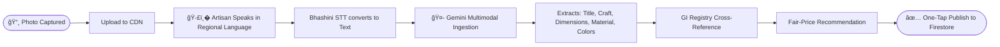
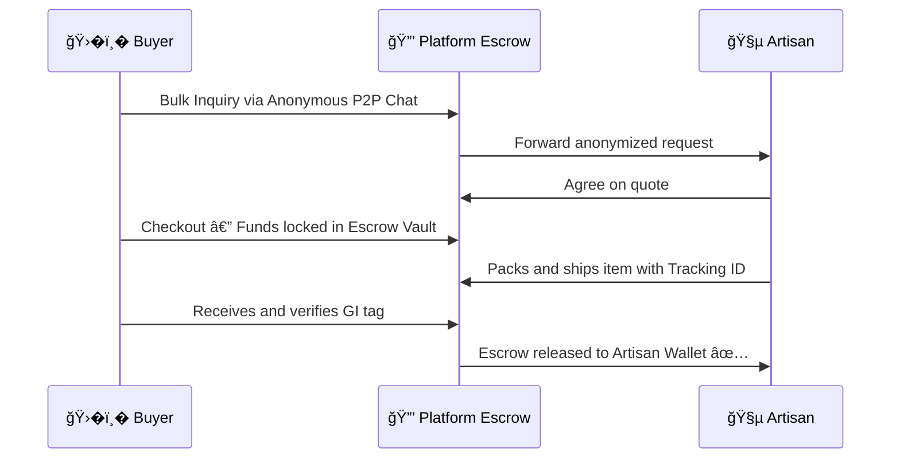

<!-- ������������������������������������������������������������������� -->
<!--  DHAAGA • धाà¤-ा — README                                           -->
<!--  Theme-aware · Lucide icons · Mobile-first responsive layout      -->
<!-- ������������������������������������������������������������������� -->

<div align="center">

<picture>
  <source media="(prefers-color-scheme: dark)" srcset="https://readme-typing-svg.demolab.com?font=Outfit&weight=800&size=52&pause=1200&color=F5A623&center=true&vCenter=true&width=700&height=90&lines=🧵+धाà¤-ा+•+DHAAGA;ShilpSetu+Platform;Artisan+Commerce+AI">
  
</picture>

<br/>

<p align="center">
  <b>Connecting Hands to Markets</b><br/>
  <i>From Village Craft to Global Cart in Under 5 Minutes</i><br/>
  <sub>Empowering 7M+ traditional weavers, sculptors and folk artists across 28 states and 8 UTs of India</sub>
</p>

<br/>

[](https://sih.gov.in)
[](https://developer.android.com)
[](https://kotlinlang.org)

[](https://developer.android.com/jetpack/compose)
[](https://firebase.google.com)
[](https://ai.google.dev)
[](LICENSE)

<br/>

<p>
  <a href="#-overview">Overview</a> &nbsp;•&nbsp;
  <a href="#-key-features">Features</a> &nbsp;•&nbsp;
  <a href="#-architecture">Architecture</a> &nbsp;•&nbsp;
  <a href="#-design-system">Design</a> &nbsp;•&nbsp;
  <a href="#-project-structure">Structure</a> &nbsp;•&nbsp;
  <a href="#-getting-started">Get Started</a> &nbsp;•&nbsp;
  <a href="#-roadmap">Roadmap</a>
</p>

</div>

---

## 🌟 Overview

> **Dhaaga (धाà¤-ा · ShilpSetu)** is an AI-powered, multilingual, zero-barrier mobile commerce platform built for India's 7 million+ artisans — eliminating every traditional obstacle between a rural craftsperson and a global buyer.

### 🚧 The Problem

| Barrier | Impact |
|:---|:---|
| 📵 Digital illiteracy | Cannot list on e-commerce |
| 📷 No studio photography | Listings look uncompetitive |
| 💸 Middlemen take 70–80% | Artisans earn a fraction |
| � English-only portals | Excluded from GeM & ONDC |
| � No copywriting skills | Poor discoverability & SEO |

### ✅ The Solution

| Feature | Value |
|:---|:---|
| ğŸ-£ï¸� Voice onboarding | Zero typing required |
| ğŸ¤- AI Image Studio | Raw photo to studio listing |
| �� Direct sale pricing | No middlemen, fair trade |
| � 22 Indian languages | Full regional inclusivity |
| �� Real-time cloud sync | Always-available inventory |

---

## ✨ Key Features

### 🧵 Artisan (Seller) Experience

<table>
<tr>
<td align="center" width="33%">
  
  <br/><b>Voice Onboarding</b>
  <br/><sub>Real-time TTS guide in Hindi & English with zero cold-start via <code>AppTtsManager</code></sub>
</td>
<td align="center" width="33%">
  
  <br/><b>AI Listing Wizard</b>
  <br/><sub>5-step flow: photo, AI enhance, smart catalog, pricing, one-tap publish</sub>
</td>
<td align="center" width="33%">
  
  <br/><b>AI Image Studio</b>
  <br/><sub>ML Kit background removal + studio backdrop filters + Gemini vision enhancement</sub>
</td>
</tr>
<tr>
<td align="center" width="33%">
  
  <br/><b>Coupon Engine</b>
  <br/><sub>% or ₹ flat discounts, auto-generate codes, validity 10min to 3 months</sub>
</td>
<td align="center" width="33%">
  
  <br/><b>Live Dashboard</b>
  <br/><sub>Inventory cards, status badges, stock tracking & price editing in real-time</sub>
</td>
<td align="center" width="33%">
  
  <br/><b>GI Tag Verification</b>
  <br/><sub>Auto-detect & cross-reference 400+ Geographical Indication craft registries</sub>
</td>
</tr>
</table>

### �� Connoisseur (Buyer) Experience

<table>
<tr>
<td align="center" width="50%">
  
  <br/><b>Voice Search</b>
  <br/><sub>Tap the mic on the Home search bar to find authentic crafts by voice</sub>
</td>
<td align="center" width="50%">
  
  <br/><b>Kahaani Stories</b>
  <br/><sub>Cultural narratives, tribal history & artisan workshop credentials per product</sub>
</td>
</tr>
<tr>
<td align="center" width="50%">
  
  <br/><b>Smart Checkout</b>
  <br/><sub>Live discount calculations, coupon redemption & instant stock deduction</sub>
</td>
<td align="center" width="50%">
  
  <br/><b>Order Tracking</b>
  <br/><sub>Pending, Confirmed, Packed, Shipped, Delivered — with one-tap cancellation</sub>
</td>
</tr>
</table>

### âš¡ Unified Single-APK Engine

One lightweight APK (`com.dhaaga.app`) dynamically reconfigures its entire navigation hierarchy, bottom bars, and feature set based on the authenticated user's role:

**🧵 Seller Mode**

| Screen | Description |
|:---|:---|
| � Home Grid | Marketplace browsing |
| 📋 My Listings | Active inventory management |
| � AI Add Product | 5-step listing wizard |
| 📊 Dashboard | Sales analytics & earnings |
| 👤 Artisan Profile | Storefront & wallet |

**�� Buyer Mode**

| Screen | Description |
|:---|:---|
| � Home Grid | Product discovery |
| �� Wishlist | Saved craft collection |
| 🛒 Cart & Checkout | Escrow-based purchase |
| 📦 My Orders | Live order tracking |
| 👤 Buyer Profile | Address & preferences |

---

## ğŸ�-ï¸� Architecture

Dhaaga is engineered on **Modern Android Architecture (MVI / Clean MVVM)** with 100% Kotlin Jetpack Compose and reactive coroutine streams.

```mermaid
graph TD
    subgraph UI ["📱 Android Client — Jetpack Compose"]
        A[MainActivity / NavHost] --> B[AppViewModel StateFlow]
        B --> C1[Onboarding and Language Flow]
        B --> C2[HomeScreen and Shared Elements]
        B --> C3[AI AddProduct Studio]
        B --> C4[ProductDetail and Kahaani]
        B --> C5[Seller Dashboard and Analytics]
        B --> C6[Cart and Escrow Checkout]
    end

    subgraph Data ["💾 Data and Domain Layer"]
        B --> D1[UserModel and ProductModel]
        B --> D2[OrderModel and CartItemModel]
        B --> D3[ImageUploadRepository]
        B --> D4[MockData Prototype Engine]
    end

    subgraph Cloud ["�� Cloud and AI Infrastructure"]
        D3 --> E1["Custom PHP CDN — upload.php"]
        B --> E2["Firebase Auth — Phone OTP / WhatsApp"]
        B --> E3["Cloud Firestore — Users, Listings, Orders"]
        B --> E4["Gemini 1.5 / 2.0 Flash — Vision + Extraction"]
        B --> E5["Bhashini ASR / TTS — 22 Languages"]
        B --> E6["Firebase Crashlytics — Real-Time Diagnostics"]
    end
```



### 🔄 The 5-Minute AI Listing Pipeline



### 🛡� Privacy-First Escrow Flow



---

## � Design System

Dhaaga's visual identity blends **Indian Heritage & Earthy Textures** with modern **Glassmorphism & Material 3** principles.

### ğŸ-Œï¸� Color Palette

| Token | Hex | Preview | Semantic Role |
|:---|:---:|:---:|:---|
| **Saffron Primary** | `#D4521A` |  | High-emphasis CTAs, active indicators, brand accent |
| **Warm Gold** | `#F5A623` |  | Featured craft tags, ratings, star highlights |
| **Teal Accent** | `#2BB5A0` |  | Verified badges, chat bubbles, GI verification tags |
| **Cream Background** | `#FFF8EE` |  | App canvas background, clean reading comfort |
| **Peach Card** | `#FDEBD0` |  | Product listing cards, tonal containers |
| **Deep Brown Text** | `#3E1F00` |  | High-contrast readable typography (headings & body) |
| **GI Tag Green** | `#4CAF50` |  | Official authenticity seal, success confirmations |

### ğŸ-‹ï¸� Typography & Interactions

**Dual-Script Typography**
Poppins (Latin) + Noto Sans Devanagari for seamless bilingual display across English, Hindi & regional scripts.

**Fintech Precision**
All monetary values stored in **paise (Long)** — e.g. ₹850.00 = `85000L` — eliminating floating-point errors entirely.

**Edge-to-Edge UI**
Fully transparent nav & status bars using Android 15/16 window insets with procedural Notion-style avatars.

---

## � Project Structure

```
Dhaaga/
├── 📱 app/
│   └── src/main/
│       ├── java/com/dhaaga/app/
│       │   ├── 🚀 MainActivity.kt               # Central NavHost, edge-to-edge config & routes
│       │   ├── 📦 AppViewModel.kt               # Unidirectional StateFlow (Auth, Cart, Products)
│       │   ├── navigation/
│       │   │   └── Routes.kt                    # Type-safe navigation routes & arguments
│       │   ├── data/
│       │   │   ├── model/
│       │   │   │   ├── UserModel.kt             # Artisan/Buyer schema, Shilpi Score, GI tags
│       │   │   │   ├── ProductModel.kt          # Craft specs, Kahaani story, pricing in paise
│       │   │   │   └── OrderModel.kt            # CartItem, Address & Order lifecycle models
│       │   │   ├── mock/
│       │   │   │   └── MockData.kt              # Rich craft dataset across 28 Indian states
│       │   │   └── repository/
│       │   │       └── ImageUploadRepository.kt # Multipart image upload client with logging
│       │   └── ui/
│       │       ├── � theme/                    # Color tokens, Typography & DhaagaTheme
│       │       ├── ✨ splash/                   # Animated splash screen
│       │       ├── � onboarding/               # 22-language selection, role switch, Phone OTP
│       │       ├── � home/                     # Dynamic Home, Pager Tabs & Category Grids
│       │       ├── ğŸ-¼ï¸� product/                  # Kahaani Product Detail, Zoom Gallery, Reviews
│       │       ├── 🧵 seller/                   # AI Add Product, My Listings, Seller Dashboard
│       │       ├── �� buyer/                    # Cart, Wishlist, My Orders & Escrow Tracking
│       │       ├── 👤 profile/                  # Artisan Storefront, Settings & Wallet
│       │       └── 🧩 components/               # NotionAvatars, Badges, Shimmer Loaders
│       ├── res/                                 # Drawables, layouts, strings, XML rules
│       └── AndroidManifest.xml                 # Hardware permissions (Camera, Audio, Storage)
├── ⚙�  app/build.gradle.kts                     # Module build file (Compose BOM, Firebase BOM)
├── 🔥 app/google-services.json                 # Firebase configuration file
├── 🛡�  app/proguard-rules.pro                   # Release optimization & obfuscation rules
├── � server_script/upload.php                 # Custom PHP multipart image upload backend
├── 📚 gradle/libs.versions.toml               # Version Catalog (Kotlin 2.3, AGP 9.2, Compose)
└── 🔑 key.properties.example                  # Release keystore configuration template
```

---

## 📊 Data Models

<details>
<summary><b>� Click to expand — Core Kotlin Schemas (User, Product, Order)</b></summary>

```kotlin
// ── UserModel ────────────────────────────────────────────────────────────
data class UserModel(
    val uid: String = "",
    val phoneNumber: String = "",
    val name: String = "",
    val role: String = "buyer",           // "seller" | "buyer"
    val languagePref: String = "en",      // "hi", "en", "bn", "ta", etc.
    val village: String = "",
    val district: String = "",
    val state: String = "",
    val craftTypes: List<String> = emptyList(),
    val shilpiScore: Int = 0,             // Trust metric (0–100)
    val isGiCertified: Boolean = false,
    val walletBalance: Long = 0L,         // Stored in paise
    val totalEarnings: Long = 0L
)

// ── ProductModel ─────────────────────────────────────────────────────────
data class ProductModel(
    val productId: String = "",
    val sellerId: String = "",
    val sellerName: String = "",
    val sellerVillage: String = "",
    val titleEn: String = "",
    val titleHi: String = "",
    val descriptionEn: String = "",
    val craftType: String = "",           // "Warli" | "Madhubani" | "Dhokra" …
    val material: String = "",
    val giTag: String = "",
    val giVerified: Boolean = false,
    val authenticityScore: Int = 95,
    val priceListed: Long = 0L,          // ₹1 = 100 paise
    val stockQuantity: Int = 1,
    val imageUrls: List<String> = emptyList(),
    val storyEn: String = ""             // Kahaani AI cultural narrative
)

// ── OrderModel ───────────────────────────────────────────────────────────
// Lifecycle: Pending � Confirmed � Packed � Shipped � Delivered
// One-tap cancellation automatically restocks seller inventory.
```

</details>

---

## 🛠� Getting Started

### 📋 Prerequisites

| Tool | Version | Notes |
|:---|:---:|:---|
| ğŸ¤- Android Studio | Ladybug 2024.2.1+ | or Meerkat 2025.1.1+ |
| ☕ JDK | 17 or 21 | OpenJDK recommended |
| 📱 Android SDK | Compile 37, Min 24 | Android 7.0+ coverage |
| � Gradle | 9.6.1 | Managed via wrapper |
| 🔀 Git | Any modern | For cloning |

### 🚀 Installation & Setup

**1 · Clone the repository**
```bash
git clone https://github.com/gtxPrime/dhaaga.git
cd dhaaga
```

**2 · Configure Firebase**
```bash
# Create a project on the Firebase Console and enable:
#   ✅ Firebase Authentication (Phone Provider)
#   ✅ Cloud Firestore
#   ✅ Firebase Storage

cp /path/to/your/google-services.json app/google-services.json
```

**3 · Configure release signing** *(optional)*
```bash
cp key.properties.example key.properties
# Edit key.properties — fill in storeFile, storePassword, keyAlias, keyPassword
```

**4 · Build & run**
```bash
# Debug build (Windows)
.\gradlew.bat assembleDebug

# Debug build (macOS / Linux)
./gradlew assembleDebug

# Install on connected device
adb install -r app/build/outputs/apk/debug/app-debug.apk
```

**5 · (Optional) Deploy the image CDN server**
```bash
# Upload server_script/upload.php to any PHP 7.4+ server (Apache/Nginx)
# Then update DEFAULT_UPLOAD_URL in ImageUploadRepository.kt
```

### 📦 Release APK

```bash
# Build signed release APK
.\gradlew.bat assembleRelease

# Artifact location (~20.7 MB)
app/build/outputs/apk/release/app-release.apk
```

> [!IMPORTANT]
> Never commit `key.properties` or `google-services.json` to version control. Both files are listed in `.gitignore`.

---

## ğŸ-ºï¸� Roadmap

| Phase | Milestone | Status |
|:---:|:---|:---:|
| **Phase 0** | Design & Foundation — Colors, Typography, Version Catalog, Edge-to-Edge | ✅ Complete |
| **Phase 1** | Interactive Prototype — Dual Mode NavHost, 14 Screens, Mock Dataset | ✅ Complete |
| **Phase 2** | Multilingual & TTS Engine — 22 Languages, Pre-warmed Zero-Delay Audio Guide | ✅ Complete |
| **Phase 3** | AI Studio & Smart Catalog — ML Kit Cutout, Gemini Multimodal Extraction | ✅ Complete |
| **Phase 4** | Promotions, Stock & Cloud — Discounts, Coupons, Voice Search, Firestore Sync | ✅ Complete |
| **Phase 5** | Production Release — Signed APK with `alphaKey.jks` | ✅ Complete |
| **Phase 6** | ONDC & GeM Integration — Catalog taxonomy compliance & submission automation | 🔜 Planned |
| **Phase 7** | Razorpay Escrow — Real money flow, UPI deep-links & wallet payouts | 🔜 Planned |

---

## � Smart India Hackathon 2026

**� Problem Statement**
AI-Powered Digital Cataloging, Fair Valuation & Market Access for Indian Artisans & Handicraft Makers.

**🧩 Domain**
E-Commerce · Generative AI · Rural Empowerment · Inclusive Digital Public Infrastructure (DPI)

**👥 Target Audience**
Tribal artisans · Weavers · SHGs · Handicraft clusters · Domestic & international connoisseurs · Institutional buyers

---

## 👥 Acknowledgments

| | Organization | Contribution |
|:---:|:---|:---|
|  | **Ministry of Textiles, GoI** | Geographical Indication data standards |
|  | **ONDC** | Open e-commerce protocol specifications |
|  | **Bhashini (NLT Mission)** | Multilingual speech resources for 22 languages |
|  | **Google DeepMind** | Gemini multimodal visual comprehension & attribute extraction |

---

## 🛠� Tech Stack

<div align="center">

[](https://kotlinlang.org)
[](https://developer.android.com/jetpack/compose)
[](https://m3.material.io)
[](https://firebase.google.com)
[](https://firebase.google.com/products/firestore)
[](https://firebase.google.com/products/auth)
[](https://ai.google.dev)
[](https://developers.google.com/ml-kit)
[](https://kotlinlang.org/docs/coroutines-overview.html)
[](https://firebase.google.com/products/crashlytics)
[](#)
[](#)

</div>

---

<div align="center">
  <br/>
  
  &nbsp;Built with love and pride for India's artisans&nbsp;
  
  <br/><br/>
  <b>Dhaaga · धाà¤-ा · ShilpSetu &copy; 2026</b>
  <br/>
  <sub>Smart India Hackathon 2026</sub>
  <br/><br/>

  [](https://en.wikipedia.org/wiki/India)
  [](#)

</div>
