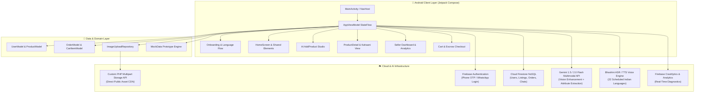

<div align="center">

# 🧵 धागा • DHAAGA
### *Connecting Hands to Markets — From Village Craft to Global Cart in Under 5 Minutes*

[](https://sih.gov.in)
[](https://developer.android.com)
[](https://kotlinlang.org)
[](https://developer.android.com/jetpack/compose)
[](https://firebase.google.com)
[](https://ai.google.dev)
[](LICENSE)

<br />

```
  ██████╗ ██╗  ██╗ █████╗  █████╗  ██████╗  █████╗ 
  ██╔══██╗██║  ██║██╔══██╗██╔══██╗██╔════╝ ██╔══██╗
  ██║  ██║███████║███████║███████║██║  ███╗███████║
  ██║  ██║██╔══██║██╔══██║██╔══██║██║   ██║██╔══██║
  ██████╔╝██║  ██║██║  ██║██║  ██║╚██████╔╝██║  ██║
  ╚═════╝ ╚═╝  ╚═╝╚═╝  ╚═╝╚═╝  ╚═╝ ╚═════╝ ╚═╝  ╚═╝
     Connecting Hands to Markets • शिल्पसेतु
```

<p align="center">
  <b>An AI-Powered, Multilingual, Zero-Barrier Mobile Commerce Platform for Indian Artisans & Connoisseur Buyers</b>
  <br />
  <i>Empowering 7M+ traditional weavers, sculptors, and folk artists across 28 states & 8 UTs.</i>
</p>

---

[Explore Features](#-key-features) • [System Architecture](#-system-architecture) • [Technical Workflows](#-technical-workflows) • [Design System](#-design-system--ui-philosophy) • [Project Structure](#-project-structure) • [Getting Started](#-getting-started) • [Roadmap](#-sih-2026-roadmap)

---

</div>

<br />

## 📖 Executive Summary

India is home to over **7 million registered artisans and master craftspeople** generating unmatched cultural heritage through crafts like *Warli Art, Madhubani Painting, Banarasi Brocade, Dhokra Brass Casting, Blue Pottery, and Pashmina Weaving*. 

However, despite massive global demand, artisans face systemic barriers:
- ❌ **The Digital Illiteracy Barrier:** Traditional e-commerce apps require complex forms, professional copywriting, and English literacy.
- ❌ **The Studio Photography Barrier:** Raw smartphone photos taken in rural workshops fail against professionally staged studio catalog listings.
- ❌ **The Intermediary & Exploitation Trap:** Middlemen siphon up to **70–80%** of the product's final retail value.
- ❌ **The Feasibility & ONDC Gap:** Artisans struggle to navigate strict Open Network for Digital Commerce (ONDC) and Government e-Marketplace (GeM) catalog taxonomies.

**Dhaaga (धागा • ShilpSetu)** dissolves these barriers:
- 🗣️ **Instant Voice Onboarding & Guidance:** Pre-warmed native TTS engine (`AppTtsManager`) providing conversational audio guidance in Hindi and English with zero cold-start delay.
- 🌐 **All 22 Scheduled Indian Languages:** Real-time localized interface with craft-specific vocabularies (`AppLanguageManager`).
- 📸 **AI Studio & Background Removal:** Turns raw workshop captures into clean studio photos using ML Kit segmentation and Google Gemini models.
- 🏷️ **Direct Sale Pricing & Time-Limited Coupons:** Flexible artisan promotions with automated coupon codes, validity windows (10 minutes to 3 months), and usage caps (`ProductDiscountCouponCard`).
- 🔍 **Integrated Voice Search:** Fast speech-recognition product discovery on the home marketplace.
- ☁️ **Bidirectional Cloud Sync:** Persistent on-device storage + Firestore cloud sync ensuring inventory and orders are never lost across logins or devices.
- 📦 **Automated Inventory & Restocking:** Live stock deductions upon order placement with automatic restocking on cancellation.

---

## 🌟 Key Features

### 🧵 1. Artisan (Seller) Experience
* **Voice Onboarding Guide (`AppTtsManager`):** Real-time voice assistance that automatically welcomes artisans and guides them through language choice, login, and store creation.
* **5-Step AI Listing Wizard:**
  1. **AI Image Enhancer & Studio:** Camera framing guide, ML Kit segmentation cutout, and studio backdrop filters.
  2. **Smart Cataloging:** Multilingual craft titles, descriptions, and regional classification.
  3. **Material & Authentic Specs:** Size, technique, region, and GI registry validation.
  4. **Fair-Trade Pricing & Promotions:** Direct sale prices with buyer savings indicators + customized discount coupons.
  5. **One-Tap Publish:** Immediate sync to Home Screen marketplace, Seller Dashboard, and Cloud Firestore.
* **Promotional Discount & Coupon Engine (`ProductDiscountCouponCard`):**
  - Direct sale pricing (strike-through original price).
  - % off or ₹ flat discounts.
  - Auto-generate code button vs custom entry.
  - Validity limits: 10 minutes to 3 months.
  - Usage limits (unlimited, 10, 25, 50, 100 uses).
* **My Listings & Dashboard:** Active inventory cards with status badges, price editing, and stock tracking.

### 🛍️ 2. Connoisseur (Buyer) Experience
* **Voice Search:** Tap the microphone on the Home search bar to search authentic crafts by voice.
* **The "Kahaani" Storytelling Engine:** Product detail views rendering cultural narratives, tribal history, and artisan workshop credentials.
* **Available Offers & Coupons Card:** Interactive promotional coupon showcase with one-tap copy and live checkout redemption.
* **Smart Cart & Checkout:** Live discount calculations, address selection, instant order summary, and automatic stock deduction.
* **Order History & Restocking:** Interactive order tracking (`Pending` ➔ `Confirmed` ➔ `Packed` ➔ `Shipped` ➔ `Delivered`) with one-tap cancellation that automatically restocks seller inventory.

### ⚡ 3. Unified Dynamic Single-APK Engine
A single lightweight Android application (`com.dhaaga.app`) dynamically reconfigures its navigation hierarchy, bottom bars, and capabilities according to the authenticated user's profile (`role = "seller"` vs `role = "buyer"`).

```
                      ┌────────────────────────────────────────┐
                      │        DHAAGA UNIFIED APP (APK)        │
                      └───────────────────┬────────────────────┘
                                          │
                        Role-Based Dynamic View Switching
                                          │
                ┌─────────────────────────┴─────────────────────────┐
                ▼                                                   ▼
      ┌───────────────────┐                               ┌───────────────────┐
      │   SELLER MODE     │                               │    BUYER MODE     │
      ├───────────────────┤                               ├───────────────────┤
      │ • Home Grid       │                               │ • Home Grid       │
      │ • My Listings     │                               │ • Wishlist        │
      │ • AI Add Product  │                               │ • Cart & Checkout │
      │ • Dashboard       │                               │ • My Orders       │
      │ • Artisan Profile │                               │ • Buyer Profile   │
      └───────────────────┘                               └───────────────────┘
```

---

## 🏗️ System Architecture

Dhaaga is engineered on **Modern Android Architecture (MVI / Clean MVVM)** with 100% Kotlin Jetpack Compose and reactive coroutine streams.



---

## 🔄 Technical Workflows

### 1. ⚡ The 5-Minute AI Listing Pipeline
```
[Artisan Takes Photo]
         │
         ▼
[Image Captured via Camera/Gallery] ──► [Uploaded to CDN via ImageUploadRepository]
         │
         ▼
[Artisan Speaks in Regional Tongue] ──► [Bhashini STT Engine converts to Text]
         │
         ▼
[Gemini Multimodal Ingestion] ────────► Extracts: { Title, Craft, Dimensions, Material, Colors }
         │
         ▼
[GI Registry Cross-Reference] ────────► Matches Village/Craft with GI Database (e.g. Warli/Palghar)
         │
         ▼
[Fair-Price Recommendation] ──────────► Generates Baseline Fair Price & Compares Market Averages
         │
         ▼
[One-Tap Publish] ────────────────────► Synchronized with Firestore & ONDC Schema Catalog
```

### 2. 🛡️ Privacy-First Escrow & Direct Commerce Flow
```
Buyer taps "Bulk Inquiry" ──► Anonymous P2P Chat initiated
                                       │
Artisan & Buyer agree on Quote ────────┤ (Contact details redacted to prevent leakage)
                                       │
Buyer proceeds to Checkout ────────────► Funds locked in Escrow Mock Vault
                                       │
Artisan packs & ships item ────────────► Tracking ID recorded in Firestore
                                       │
Buyer receives & verifies GI ──────────► Escrow released to Artisan Wallet
```

### 3. 🌐 Dual-Storage Fallback Architecture
To ensure **zero server cost barriers** during high-volume hackathon demonstrations and prototype testing, Dhaaga includes a resilient dual-engine media architecture:
1. **Primary Custom CDN (`upload.php`):** Lightweight multipart PHP API on shared hosting returning high-speed public image links with zero cold starts.
2. **Enterprise Cloud Storage:** Firebase Storage with direct tokenized access URLs and security rules.

---

## 🎨 Design System & UI Philosophy

Dhaaga's visual design embraces **Indian Heritage & Earthy Textures** combined with modern, clean **Glassmorphism & Material 3** principles.

### 🎨 Color Palette

| Token | Hex Code | Visual Sample | Semantic Role |
|:---|:---:|:---:|:---|
| **Saffron Primary** | `#D4521A` |  | High-emphasis CTAs, active indicators, brand accent |
| **Warm Gold** | `#F5A623` |  | Featured craft tags, ratings, star highlights |
| **Teal Accent** | `#2BB5A0` |  | Verified badges, chat bubbles, GI verification tags |
| **Cream Background** | `#FFF8EE` |  | App canvas background, clean reading comfort |
| **Peach Card** | `#FDEBD0` |  | Product listing cards, tonal containers |
| **Deep Brown Text** | `#3E1F00` |  | High-contrast readable typography (headings & body) |
| **GI Tag Green** | `#4CAF50` |  | Official authenticity seal, success confirmations |

### 🖋️ Typography & Interaction
* **Dual-Script Typography:** Poppins (Latin) paired with Noto Sans Devanagari for seamless bilingual typography across English, Hindi, and regional scripts.
* **Fintech Accuracy:** All monetary amounts are stored and computed in **paise (`Long`)** (e.g. ₹850.00 = `85000L`) to eliminate floating-point precision errors.
* **Notion-Style Procedural Avatars:** Custom canvas-rendered avatars for artisans and buyers without requiring photo uploads on day one.
* **Edge-to-Edge Experience:** Fully transparent navigation and status bars utilizing Android 15/16 window insets.

---

## 📁 Project Structure

```
f:/Source Codes/Dhaaga/
├── app/
│   ├── src/main/
│   │   ├── java/com/dhaaga/app/
│   │   │   ├── MainActivity.kt               # Central NavHost, edge-to-edge config & routes
│   │   │   ├── AppViewModel.kt               # Unidirectional StateFlow (Auth, Cart, Products)
│   │   │   ├── navigation/
│   │   │   │   └── Routes.kt                 # Type-safe navigation routes & arguments
│   │   │   ├── data/
│   │   │   │   ├── model/
│   │   │   │   │   ├── UserModel.kt          # Artisan/Buyer schema, Shilpi Score, GI tags
│   │   │   │   │   ├── ProductModel.kt        # Craft specs, Kahaani story, pricing in paise
│   │   │   │   │   └── OrderModel.kt          # CartItem, Address & Order lifecycle models
│   │   │   │   ├── mock/
│   │   │   │   │   └── MockData.kt           # Rich craft dataset across 28 Indian states
│   │   │   │   └── repository/
│   │   │   │       └── ImageUploadRepository.kt # Multipart image upload client with logging
│   │   │   └── ui/
│   │   │       ├── theme/                    # Color tokens, Typography & DhaagaTheme
│   │   │       ├── splash/                   # Animated splash screen
│   │   │       ├── onboarding/               # 22-Language selection, Role switch, Phone OTP
│   │   │       ├── home/                     # Dynamic Home, Pager Tabs & Category Grids
│   │   │       ├── product/                  # Kahaani Product Detail, Zoom Gallery, Reviews
│   │   │       ├── seller/                   # AI Add Product, My Listings, Seller Dashboard
│   │   │       ├── buyer/                    # Cart, Wishlist, My Orders & Escrow Tracking
│   │   │       ├── profile/                  # Artisan Storefront, Settings & Wallet
│   │   │       └── components/               # NotionAvatars, Badges, Shimmer Loaders
│   │   ├── res/                              # Drawables, layouts, strings, XML rules
│   │   └── AndroidManifest.xml               # Hardware permissions (Camera, Audio, Storage)
│   ├── build.gradle.kts                      # Module build file (Compose BOM, Firebase BOM)
│   ├── google-services.json                  # Firebase configuration file
│   └── proguard-rules.pro                    # Release optimization & obfuscation rules
├── server_script/
│   └── upload.php                            # Custom PHP multipart image upload backend
├── gradle/
│   ├── libs.versions.toml                    # Version Catalog (Kotlin 2.3, AGP 9.2, Compose)
│   └── wrapper/                              # Gradle 9.6.1 wrapper binaries
├── build.gradle.kts                          # Root project build configuration
├── settings.gradle.kts                       # Repository & dependency resolution settings
├── key.properties.example                    # Release keystore configuration template
└── README.md                                 # Master project documentation
```

---

## 📊 Data Models Overview

<details>
<summary><b>🔍 Click to view Core Kotlin Schemas (User, Product, Order)</b></summary>

```kotlin
// com.dhaaga.app.data.model.UserModel
data class UserModel(
    val uid: String = "",
    val phoneNumber: String = "",
    val name: String = "",
    val role: String = "buyer",             // "seller" | "buyer"
    val languagePref: String = "en",        // "hi", "en", "bn", "ta", etc.
    val village: String = "",
    val district: String = "",
    val state: String = "",
    val craftTypes: List<String> = emptyList(),
    val shilpiScore: Int = 0,               // Trust metric (0 - 100)
    val isGiCertified: Boolean = false,
    val walletBalance: Long = 0L,           // Stored in paise
    val totalEarnings: Long = 0L
)

// com.dhaaga.app.data.model.ProductModel
data class ProductModel(
    val productId: String = "",
    val sellerId: String = "",
    val sellerName: String = "",
    val sellerVillage: String = "",
    val titleEn: String = "",
    val titleHi: String = "",
    val descriptionEn: String = "",
    val craftType: String = "",             // "Warli", "Madhubani", "Dhokra"
    val material: String = "",
    val giTag: String = "",
    val giVerified: Boolean = false,
    val authenticityScore: Int = 95,
    val priceListed: Long = 0L,             // Price in paise (₹1 = 100 paise)
    val stockQuantity: Int = 1,
    val imageUrls: List<String> = emptyList(),
    val storyEn: String = ""                // Kahaani AI cultural narrative
)
```
</details>

---

## 📦 Signed Release APK

The production release APK is built and signed with the official `alphaKey.jks` release keystore.

### 🔑 Signing Configuration (`key.properties`):
```properties
storeFile=F:/MyAppKey/alphaKey.jks
storePassword=Topicno+0987
keyAlias=key0
keyPassword=Topicno+0987
```

### 📍 Artifact Location:
```text
app/build/outputs/apk/release/app-release.apk (Size: ~20.7 MB)
```

### 🔨 Build Commands:
```bash
# Build Signed Release APK
gradlew.bat assembleRelease

# Install Release APK on connected device
adb install -r app/build/outputs/apk/release/app-release.apk
```

---

## 🚀 Getting Started

### 📋 Prerequisites
* **Android Studio:** Ladybug (2024.2.1+) or Meerkat (2025.1.1+)
* **JDK:** OpenJDK 17 or 21
* **Android SDK:** Compile SDK `37`, Minimum SDK `24` (Android 7.0+)
* **Gradle:** Version 9.6.1 (managed via Gradle Wrapper)

### 🛠️ Installation & Setup

1. **Clone the Repository:**
   ```bash
   git clone https://github.com/your-username/dhaaga.git
   cd dhaaga
   ```

2. **Configure Firebase:**
   - Create a project on the [Firebase Console](https://console.firebase.google.com/).
   - Enable **Firebase Authentication** (Phone Provider), **Cloud Firestore**, and **Firebase Storage**.
   - Download `google-services.json` and place it in the `app/` directory:
     ```bash
     cp /path/to/your/google-services.json app/google-services.json
     ```

3. **Configure Signing Keys (Optional for Release):**
   ```bash
   cp key.properties.example key.properties
   # Fill in storeFile, storePassword, keyAlias, keyPassword in key.properties
   ```

4. **Build and Run the Debug APK:**
   ```bash
   # On Windows PowerShell
   .\gradlew.bat assembleDebug

   # On Linux / macOS
   ./gradlew assembleDebug
   ```

5. **Deploy the Image Server (Optional):**
   If you wish to host your own multipart CDN endpoint:
   - Upload `server_script/upload.php` to any PHP-compatible web server (Apache/Nginx with PHP 7.4+).
   - Update `DEFAULT_UPLOAD_URL` in [ImageUploadRepository.kt](file:///f:/Source%20Codes/Dhaaga/app/src/main/java/com/dhaaga/app/data/repository/ImageUploadRepository.kt).

---

## 🗺️ SIH 2026 Roadmap

```
  [Phase 0: Design & Foundation] ─────────► ✅ Complete (Colors, Typography, Version Catalog, Edge-to-Edge)
  [Phase 1: Interactive Prototype] ───────► ✅ Complete (Dual Mode NavHost, 14 Screens, Mock Dataset)
  [Phase 2: Multilingual & TTS Engine] ───► ✅ Complete (22 Languages, Pre-warmed Zero-Delay Audio Guide)
  [Phase 3: AI Studio & Smart Catalog] ───► ✅ Complete (ML Kit Cutout, Gemini Multimodal Extraction)
  [Phase 4: Promotions, Stock & Cloud] ───► ✅ Complete (Discounts, Coupons, Voice Search, Firestore Sync)
  [Phase 5: Production Release] ──────────► ✅ Complete (Signed Release APK with alphaKey.jks)
```

---

## 🏆 Smart India Hackathon 2026

* **Problem Statement:** AI-Powered Digital Cataloging, Fair Valuation & Market Access Platform for Indian Artisans and Handicraft Makers.
* **Domain:** E-Commerce, Generative AI, Rural Empowerment, Inclusive Digital Public Infrastructure (DPI).
* **Target Audience:** Tribal artisans, weavers, SHGs (Self-Help Groups), handicraft clusters, domestic/international connoisseurs, and institutional buyers.

---

## 👥 Contributors & Acknowledgments

* **Lead Developers & Architects:** Team Dhaaga (SIH 2026 Finalists)
* **Special Thanks:**
  * **Ministry of Textiles, Government of India** — for Geographical Indication data standards.
  * **Open Network for Digital Commerce (ONDC)** — for open e-commerce protocol specifications.
  * **Bhashini (National Language Translation Mission)** — for multilingual speech resources.
  * **Google DeepMind & Gemini API** — for multimodal visual comprehension and structured extraction.

---

<div align="center">
  <sub>Built with ❤️ and Pride for India's Artisans • <b>Dhaaga © 2026</b></sub>
</div>
