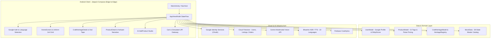

<!-- DHAAGA README | Theme-aware | Cultural Terracotta Palette | Mobile-first -->

<div align="center">

<picture>
  <source media="(prefers-color-scheme: dark)" srcset="https://readme-typing-svg.demolab.com?font=Outfit&weight=800&size=48&pause=1200&color=E07A5F&center=true&vCenter=true&width=680&height=80&lines=DHAAGA+%E2%80%A2+%E0%A4%A7%E0%A4%BE%E0%A4%97%E0%A4%BE;ShilpSetu+Platform;Artisan+Living+Heritage+%2B+AI">
  
</picture>

<br/>

<p align="center">
  <b>Connecting Hands to Markets</b><br/>
  <i>From Village Craft to Global Cart in Under 5 Minutes</i><br/>
  <sub>Empowering 7M+ traditional weavers, sculptors and folk artists across 28 states and 8 UTs of India</sub>
</p>

<br/>

[](https://sih.gov.in)
[](CHANGELOG.md)
[](https://developer.android.com)
[](https://kotlinlang.org)

[](https://developer.android.com/jetpack/compose)
[](https://firebase.google.com)
[](https://ai.google.dev)
[](LICENSE)

<br/>

<p>
  <a href="#-overview">Overview</a> &nbsp;•&nbsp;
  <a href="#-key-features">Features</a> &nbsp;•&nbsp;
  <a href="#-living-heritage--oral-archives">Living Heritage</a> &nbsp;•&nbsp;
  <a href="#-architecture">Architecture</a> &nbsp;•&nbsp;
  <a href="#-design-system">Design System</a> &nbsp;•&nbsp;
  <a href="#-project-structure">Structure</a> &nbsp;•&nbsp;
  <a href="#-getting-started">Get Started</a> &nbsp;•&nbsp;
  <a href="#-release-artifacts">Release APK</a>
</p>

</div>

---

##  Overview

> **Dhaaga (ShilpSetu)** is an AI-powered, multilingual, zero-barrier mobile commerce and living heritage platform built for India's 7 million+ traditional artisans. It bridges rural craft clusters directly to conscious global connoisseurs with real-time cloud cataloging, GI Tag authenticity verification, and bilingual oral storytelling.

###  The Problem

| Barrier | Impact |
|:---|:---|
| Digital illiteracy | Cannot navigate standard e-commerce dashboards |
| No studio photography | Handcrafted masterworks look uncompetitive |
| Middlemen exploiters | Intermediaries absorb 70–80% of final retail margins |
| English-only portals | Rural craftspeople excluded from digital markets |
| Cultural disconnect | Ancient oral stories and heritage origins get lost |

###  The Solution

| Feature | Value |
|:---|:---|
| **Google One-Tap Auth** | Seamless, zero-friction account verification |
| **Living Heritage Registry** | 5,000-year craft lineages with bilingual audio archive tapes |
| **AI Image & Catalog Studio** | Raw workshop photos transformed into studio listings via Gemini Vision |
| **GI Tag Certification** | Official Geographical Indication registry verification |
| **Direct Escrow Payouts** | Fair trade valuation with 100% earnings to artisan wallet |
| **22 Indian Languages** | Voice-first TTS/ASR accessibility with zero latency |

---

##  Key Features

###  Artisan (Shilpkar) Experience

<table>
<tr>
<td align="center" width="33%">
  
  <br/><b>Voice-First Flow</b>
  <br/><sub>Real-time TTS onboarding guide in Hindi & English via AppTtsManager</sub>
</td>
<td align="center" width="33%">
  
  <br/><b>AI Listing Wizard</b>
  <br/><sub>5-step flow: photo upload, AI enhancement, smart specs, pricing, publish</sub>
</td>
<td align="center" width="33%">
  
  <br/><b>AI Image Studio</b>
  <br/><sub>ML Kit backdrop isolation + Gemini Vision attribute extraction</sub>
</td>
</tr>
<tr>
<td align="center" width="33%">
  
  <br/><b>GI Tag Cross-Reference</b>
  <br/><sub>Auto-verification against 400+ Ministry of Textiles GI craft registrations</sub>
</td>
<td align="center" width="33%">
  
  <br/><b>Smart Coupon Engine</b>
  <br/><sub>Percentage and flat discounts with custom validity windows</sub>
</td>
<td align="center" width="33%">
  
  <br/><b>Real-Time Dashboard</b>
  <br/><sub>Live stock counts, revenue tracking, and one-tap order fulfillment</sub>
</td>
</tr>
</table>

###  Connoisseur (Buyer) Experience

<table>
<tr>
<td align="center" width="50%">
  
  <br/><b>Oral History Audio Guides</b>
  <br/><sub>Listen to master artisans narrating lineage tapes in Hindi, Marathi, and English</sub>
</td>
<td align="center" width="50%">
  
  <br/><b>Kahaani Cultural Narratives</b>
  <br/><sub>Deep cultural stories, tribal origins, and raw material provenance</sub>
</td>
</tr>
<tr>
<td align="center" width="50%">
  
  <br/><b>Simulated UPI & Escrow Gateway</b>
  <br/><sub>GPay, PhonePe, Paytm, BHIM, Cards, NetBanking with real Firestore state sync</sub>
</td>
<td align="center" width="50%">
  
  <br/><b>Live Milestone Order Tracking</b>
  <br/><sub>Pending → Confirmed → Packed → Shipped → Delivered with instant status sync</sub>
</td>
</tr>
</table>

---

##  Living Heritage & Oral Archives

Dhaaga integrates a standalone cultural registry celebrating master artisans and GI-registered craft ecosystems across India:

```
HeritageRegistry
├── Warli Folk Painting         (Palghar, Maharashtra — 2,500 Yrs • Sacred Geometric Art)
├── Madhubani Mithila Painting   (Mithila, Bihar — 3,000 Yrs • Mineral Pigment Friezes)
├── Pashmina Shawl Weaving       (Srinagar, Kashmir — 600 Yrs • Changthangi Cashmere Loom)
├── Dhokra Bell Metal Casting    (Bastar, Chhattisgarh — 4,000 Yrs • Lost-Wax Casting)
└── Jaipur Blue Pottery         (Kot Jewar, Rajasthan — Clayless Quartz & Cobalt Glaze)
```

Each craft detail page features:
* **Bespoke High-Res Visual Assets:** Packaged local drawables ensuring instant offline fidelity.
* **Master Artisan Dossier:** Name, generational lineage, workshop village, and national recognition awards.
* **Dual-Language Oral History Tape:** Streamable bilingual recordings capturing the philosophy of the craft.
* **Direct Craft Association:** Direct links to authentic products created by certified guild masters.

---

##  Architecture

Dhaaga is engineered on **Modern Android Architecture (MVI / Clean MVVM)** with 100% Kotlin Jetpack Compose and reactive coroutine streams.


```mermaid
graph TD
    subgraph UI ["Android Client - Jetpack Compose (Edge-to-Edge)"]
        A[MainActivity / NavHost] --> B[AppViewModel StateFlow]
        B --> C1[Google Auth & Language Selection]
        B --> C2[HomeScreen & Uniform 2x4 Grid]
        B --> C3[CraftHeritageDetail & Oral Tape]
        B --> C4[ProductDetail & Kahaani Narrative]
        B --> C5[AI AddProduct Studio]
        B --> C6[Cart & Simulated UPI Gateway]
    end
    subgraph Data ["Data & Domain Layer"]
        B --> D1[UserModel - Google Profile & ShilpiScore]
        B --> D2[ProductModel - GI Tags & Paise Pricing]
        B --> D3[CraftHeritageModel & HeritageRegistry]
        B --> D4[MockData - 28-State Master Catalog]
    end
    subgraph Cloud ["Cloud & AI Infrastructure"]
        B --> E1["Google Identity Services (OAuth)"]
        B --> E2["Cloud Firestore - Users, Listings, Orders"]
        B --> E3["Gemini Multimodal Vision API"]
        B --> E4["Bhashini ASR / TTS - 22 Languages"]
        B --> E5["Firebase Crashlytics"]
    end
```

---

##  Design System

Dhaaga features a **Warm Terracotta & Cultural Artisan Theme** inspired by Indian pottery, handlooms, and indigenous minerals.

### Color Tokens

| Token | Hex | Preview | Role |
|:---|:---:|:---:|:---|
| **Terracotta Primary** | `#C85A32` |  | Brand primary, action CTAs, key accent |
| **Warm Clay** | `#E07A5F` |  | Secondary accents, hero gradient end |
| **Ochre Gold** | `#DDA15E` |  | GI Tag badges, award stars, highlights |
| **Warm Sand** | `#F4EFEA` |  | Card containers, surface tonal cards |
| **Ivory Canvas** | `#FDFBF7` |  | Main screen canvas background |
| **Deep Charcoal** | `#1F1D1B` |  | Primary headings, luxury text contrast |
| **Muted Slate** | `#6B635B` |  | Subtitles, specifications, captions |

---

##  Project Structure

```
Dhaaga/
├── app/src/main/
│   ├── java/com/dhaaga/app/
│   │   ├── MainActivity.kt               # NavHost, Edge-to-Edge, Heritage routes
│   │   ├── AppViewModel.kt               # Central StateFlow (Auth, Cart, Orders, GPS)
│   │   ├── navigation/Routes.kt          # Type-safe Jetpack Compose routes
│   │   ├── data/
│   │   │   ├── model/UserModel.kt        # Google auth profile, ShilpiScore
│   │   │   ├── model/ProductModel.kt     # Craft specs, GI tags, Kahaani story
│   │   │   ├── model/CraftHeritageModel.kt# Cultural dossier, audio oral history
│   │   │   ├── mock/MockData.kt          # 8-product balanced catalog
│   │   │   └── mock/HeritageRegistry.kt  # 5 living heritage master archives
│   │   └── ui/
│   │       ├── theme/                    # Terracotta color tokens & typography
│   │       ├── onboarding/               # Google Auth, Language, Role Setup
│   │       ├── home/                     # Dynamic Home, Heritage cards, 2x4 Grid
│   │       ├── heritage/                 # CraftHeritageDetailScreen & Audio Tapes
│   │       ├── product/                  # ProductDetailScreen & Docked Bottom Bar
│   │       ├── seller/                   # AI Add Product Wizard, Dashboard
│   │       ├── buyer/                    # Cart, Simulated Payment, Order Tracking
│   │       └── components/               # Resilient CardAsyncImage, Nav FAB
│   ├── res/
│   │   ├── drawable/                     # High-res craft banners & vector icons
│   │   └── values/                       # App strings and style definitions
│   └── AndroidManifest.xml
├── CHANGELOG.md                          # Release history & milestone log
└── key.properties.example                # Keystore configuration template
```

---

##  Getting Started

### Prerequisites

| Tool | Version |
|:---|:---|
|  Android Studio | Ladybug 2024.2.1+ or Meerkat 2025.1.1+ |
|  JDK | OpenJDK 17 or 21 |
|  Android SDK | Compile SDK 37, Min SDK 24 (Android 7.0+) |
|  Gradle | 9.6.1 via wrapper |

### Build Instructions

```bash
# Clone repository
git clone https://github.com/gtxPrime/dhaaga.git
cd dhaaga

# Build debug APK
.\gradlew.bat assembleDebug

# Build production release APK
.\gradlew.bat assembleRelease
```

---

##  Release Artifacts

The latest production-signed release APK is available directly in the build outputs:

* **APK File:** [`app/build/outputs/apk/release/app-release.apk`](app/build/outputs/apk/release/app-release.apk)
* **Version:** `v0.3.0` (Version Code `2`)
* **Size:** ~27.4 MB (`27,445,462 bytes`)
* **Signing Keystore:** Release keystore (`alphaKey.jks`, alias `key0`)
* **Installation:**
  ```bash
  adb install -r app/build/outputs/apk/release/app-release.apk
  ```

For detailed release highlights, see [CHANGELOG.md](CHANGELOG.md).

---

<div align="center">
  <br/>
  
  &nbsp;Preserving Living Craft Traditions for India's 7M+ Artisans&nbsp;
  
  <br/><br/>
  <b>Dhaaga · ShilpSetu &copy; 2026</b>
  <br/>
  <sub>Smart India Hackathon 2026</sub>
</div>